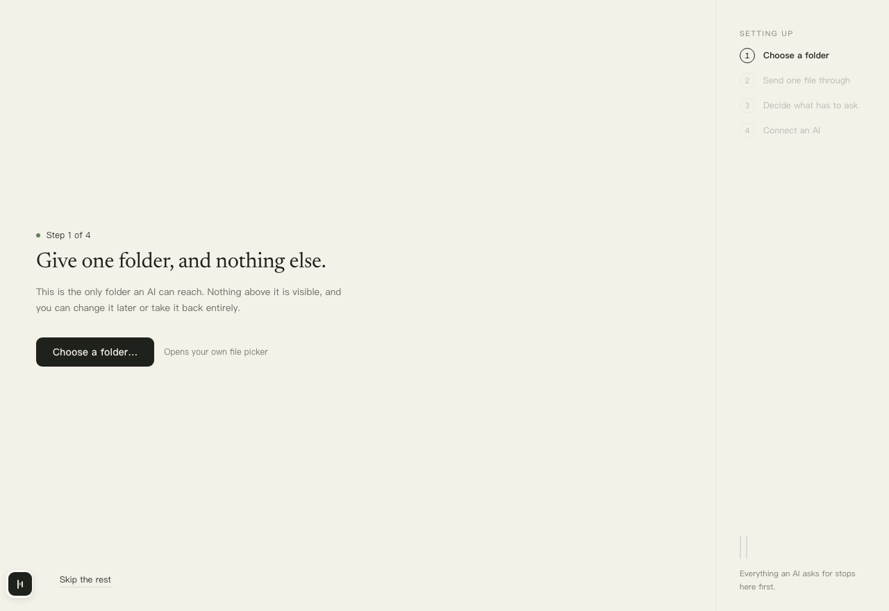
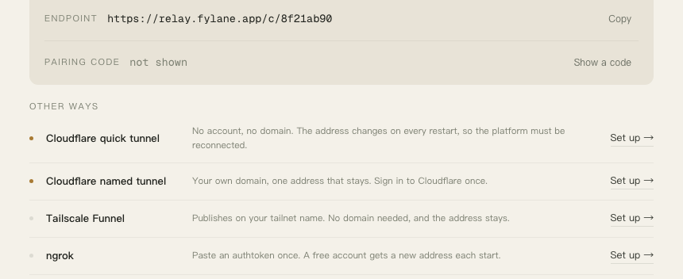
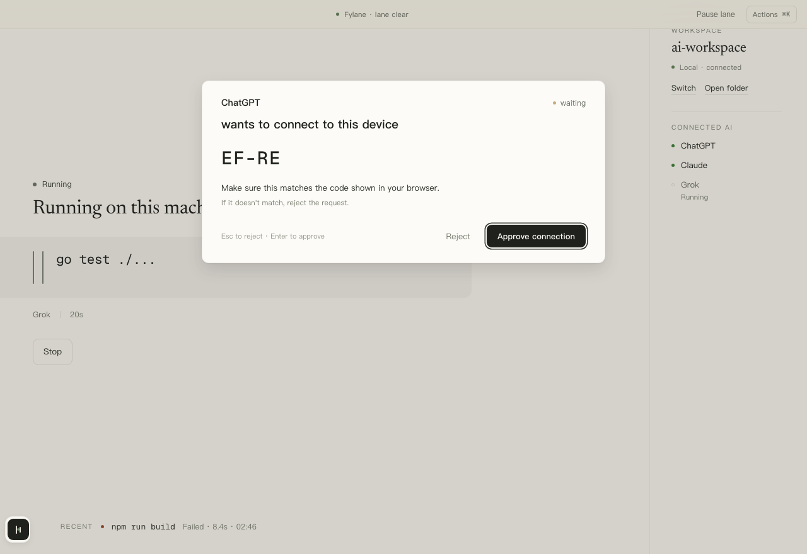

<div align="center">


# Fylane

**Let ChatGPT, Claude and Grok on the web read and edit a project folder on your computer, or on your VPS. Edits and commands are confirmed on your machine before they happen.**

English | [简体中文](README.zh-CN.md)

[](LICENSE)
[](go.mod)
[](https://modelcontextprotocol.io)

</div>

<br>

## What it is

You use ChatGPT, Claude or Grok in the browser. They cannot see the project on
your computer. To get one file changed you paste code in and paste the answer
back out, dozens of times a day.

Fylane is a small program you install on your computer. You pick one folder
and it turns that folder into an MCP server, so the AI in your browser can
connect to it the way it connects to a plugin: read the files, edit code, run
the tests.

It differs from "hand the computer to the AI" in one essential way. The AI can
only *ask*. The actual write or command happens on your machine, and each one
goes through a confirmation in the Fylane window first. You see what it wants
to change, you approve, then it lands on disk.

Typical uses:

- Let ChatGPT read the project and answer "where is this error thrown" without
  pasting code.
- Let Claude edit three files, review the diff in Fylane, then approve.
- Let Grok run `npm test` in your project and read the output back.
- Same thing when the project lives on a VPS. Bring that machine in and the
  AI edits and runs tests on the server; you still approve on this computer.
  See [Remote machines](#remote-machines).
- Close the lid and the AI cannot reach the machine. Nothing was uploaded.

## How it works

```
AI in the browser  ──►  public address (tunnel or relay)  ──►  Fylane on your computer  ──►  the folder you chose
                                                                        │
                                                                approval happens here
```

Fylane is the only process that touches disk. The tunnel or relay in the
middle forwards encrypted frames and stores no file, no diff, no path. Every
path the AI sees is relative; it never learns where the folder is on your
machine.

When the folder is on a VPS there is one more hop, over ssh:

```
AI in the browser  ──►  public address  ──►  Fylane on your computer  ──ssh──►  Fylane on the VPS  ──►  the folder on the server
                                                      │
                                              approval still happens here
```

The Fylane on the VPS opens no port to the outside; only this computer can
reach it, through ssh. Nothing changes on the platform side, it keeps
connecting to the same address.

## Install

Download from [Releases](https://github.com/leazoot/fylane/releases/latest):

| System | Download |
| --- | --- |
| macOS | `fylane-desktop-macos.dmg`, drag into Applications |
| Windows | `fylane-desktop-windows-amd64.zip`, unzip and run `Fylane.exe` |
| Linux / servers | command line only for now, one command to install, see [Command line](#command-line) |

The packages are not signed yet. On first open macOS says the developer cannot
be verified: go to System Settings → Privacy & Security and choose Open Anyway.
Windows SmartScreen: More info → Run anyway. Every file's SHA-256 is in
`SHA256SUMS` on the release page if you want to check before opening.

## First run

Fylane walks you through four steps, all inside the window. No terminal.



1. **Choose a folder.** This is the only place the AI can see. Nothing above it
   exists to the AI. You can change it or take it back at any time.
2. **Send one file through.** Fylane writes a sample file into the folder so
   you see what an approval looks like once: the content appears first, you
   approve, then the file exists.
3. **Decide what has to ask.** The default is "ask once per folder": the first
   ordinary command needs a yes, after that ordinary commands in the same
   folder just run, while every file write and every dangerous command still
   asks. You can switch to asking every time, or to not asking for ordinary
   commands at all.
4. **Connect an AI.** This step happens on the AI platform's side, next
   section.

Then you are on the main screen. The left is the lane: requests waiting for you
show up here. The right is the current folder and the AIs connected to it.


## Connecting Fylane to an AI platform

Whichever platform, it is the same three moves: get an address from Fylane,
paste it into the platform's connector settings, approve the connection in the
Fylane window.

### Step 1: get the address from Fylane

Open **Settings → Connection**.



The first time, choose **Cloudflare quick tunnel** and click Set up. No
account, no domain. A few seconds later an address like
`https://xxx.trycloudflare.com/mcp` appears here. Click Copy.

This address changes every time Fylane restarts and the platform has to be
updated. When you are done trying it out and want an address that stays, see
[A fixed address](#a-fixed-address).

### Step 2: paste it into the platform

<details open>
<summary><b>ChatGPT</b></summary>

Needs a paid plan (Plus, Pro or Team).

1. Avatar → **Settings → Apps & Connectors** (called **Plugins** in the newer
   UI) → **Advanced** → turn on **Developer mode**.
2. Back on the connectors page, click **Create**.
   - Name: anything, for example `Fylane`
   - MCP server URL: paste the address
   - Authentication: **OAuth**. Choosing "No authentication" fails with
     `Error creating connector`, because the address requires a login.
3. Click Create. ChatGPT completes the handshake in the background and then
   opens a browser page, see step 3.
4. In a chat, click **+** next to the input → **More** and tick `Fylane`.
   That chat can now use it.

<!-- screenshot: assets/setup/chatgpt-developer-mode.png (Settings → Apps & Connectors → Advanced → Developer mode) -->
<!-- screenshot: assets/setup/chatgpt-create-connector.png (the create form with Authentication set to OAuth) -->

</details>

<details>
<summary><b>Claude</b></summary>

1. Avatar at the bottom left → **Settings → Connectors** → **Add custom
   connector**.
2. Name it `Fylane` and paste the address as the remote MCP server URL.
   **Leave both Client ID and Client Secret under Advanced empty.** Fylane
   registers the client itself; filling them in causes an error.
3. Click Add. When Fylane appears in the list, click **Connect** next to it.
   The browser opens an authorization page, see step 3.
4. In a chat, open the **tools** button on the input and make sure Fylane is
   enabled.

Claude groups the tools into read-only and write, and each can be set to
"ask every time" or "always allow". Those are platform-side hints; they do not
change the approval on your machine.

<!-- screenshot: assets/setup/claude-add-connector.png (the add custom connector form) -->

</details>

<details>
<summary><b>Grok</b></summary>

1. grok.com → **Settings → Connectors** → add a custom MCP connector and paste
   the address.
2. Click connect. The browser opens the authorization page, see step 3.

Two things are different on Grok and worth knowing up front:

- **Grok shows no write confirmation of its own.** When the model decides to
  edit, the request goes out. All protection is the approval on your machine,
  so do not set the approval level to "never ask" while using Grok.
- Grok has its own cloud Linux sandbox. Say "run the tests in the project" and
  it may run them there, not on your computer. Name the tool: "use the
  Fylane connector's run_command to run the tests".
- Grok waits 60 seconds per tool call. A write needs your approval; if you have
  not approved within 60 seconds it receives "pending approval". Approve, then
  ask it to try again.

<!-- screenshot: assets/setup/grok-add-connector.png -->

</details>

### Step 3: approve the connection in Fylane

The platform opens a Fylane authorization page showing a short code. At the
same time the Fylane window on your computer shows the same code. Check they
match and click **Approve connection**.



If the browser page cannot find Fylane on this machine (you are in a browser on
another computer, say), the page asks for a pairing code instead. In Fylane go
to **Settings → Connection**, click **Show a code**, and type it in. A code is
valid for 10 minutes and works once.

### Try it

Back in the chat, type:

> List the files in the root of this project.

The AI calls Fylane and lists the folder. Reads need no approval. Then:

> Create hello.txt in the project with the content "hello".

Now the Fylane window lights up and shows what the AI wants to write. Approve
and the file appears in the folder. Reject and the AI is told it was refused.

## Approval and the security boundary

What Fylane actually does, and what you will see in the window.

**Writes need approval.** When the AI wants to write, edit, delete or move a
file, the request goes to the Fylane window first. You see the full diff, not
a line saying "the AI wants to change a file". It lands on disk after you
approve.

**An approved write can be undone for 7 days.** Fylane keeps a copy of the
original before each write. Roll back from the Tasks page. If something else
changed the file in the meantime the rollback refuses rather than overwrite.

**Commands are bounded.** The AI passes a program and its arguments, never a
shell line. No pipes, no `sh -c`. `rm -rf`, `sudo`, killing processes, writing
to system directories are refused at every approval level.

**Reads that reveal the machine ask separately.** Listing processes, reading
environment variables, reading a file outside the workspace: these stop and
ask at every level.

**Sensitive files are hidden by default.** `.env`, `*.pem`, `id_rsa`,
`credentials*` and the like are left out of listings and skipped in search. If
the AI asks for one by name you get a separate confirmation.

**Subprocesses are locked into the folder by the OS.** A program Fylane starts
for the AI (`npm test`, say) is confined with `sandbox-exec` on macOS and
Landlock on Linux: it can read this workspace and the toolchain caches, and
the operating system refuses everything else. Windows has no equivalent and
relies on the other layers above.

**The AI does not know where the folder is.** Tools accept relative paths
only. Absolute paths never appear in anything sent to the AI.

**The frequency is yours; the checks are not.** Ask every time, once per
folder, or not for ordinary commands. Whichever you choose, the path checks,
the dangerous-command rules and the audit record keep running.

Every record stays on this machine. The Tasks page shows each request, who
sent it and what happened.


## Remote machines

The project lives on a VPS, you sit at a Mac, and you want the AI to edit and
run tests over there. Fylane can bring a remote machine in without changing
anything on the platform side: it is still one connector, and `workspace_info`
simply lists that machine's folders alongside your own, each with the
machine's name.

**Prerequisite**: from a terminal on this computer, `ssh user@host` already
logs in with a key. Fylane uses the system ssh, so your keys, known_hosts and
`~/.ssh/config` aliases all apply as they are. It never asks for a password.

1. On the lane, under **Machine** in the rail, click **Switch machine → Add a
   remote machine…**. Type the destination the way you would after `ssh`: an
   alias, `user@host`, `host:2222`. Fylane knocks straight away and says what
   is on the other side. The name defaults to the host and can be changed at
   any time with **Edit** in the rail.
2. If Fylane is not on that machine yet, the rail says so and offers
   **Install Fylane**. One click runs `install.sh` there over ssh, pinned to
   the same version as this app and checked against SHA256SUMS. Fylane then
   starts the remote side itself, and checks it is running on every connect.
3. Once it reads **Connected**, click **Choose a folder** under Workspace. The
   sheet opens in that machine's home; step into folders (repositories are
   marked `git`) or type a path such as `~/project`. Nothing is granted until
   the machine confirms it is a folder, so a typo cannot be granted.

From there it works like a local folder. Reads, writes and commands in that
folder happen on the VPS; approvals come back to the window on your Mac. On
the Tasks page, a record from a remote machine carries the machine's name as
a small chip before the command; local records carry none.

Things to know:

- **The remote Fylane publishes nothing.** No tunnel, no pairing; it listens
  on that machine's loopback only, and this computer reaches it through an ssh
  port forward. This computer is its tunnel, so the VPS is unreachable while
  the Mac is off.
- **Approval happens here only.** A remote machine's command setting defaults
  to asking every time, and every question arrives in the Mac window.
- **Switching machines moves the lane, not the record.** The Tasks page keeps
  showing every machine, and a pending request is never hidden by the switch.
- The remote side keeps its data in `~/.fylane/` on that machine (program,
  database, audit record, `serve.log`). **Remove** only makes this computer
  forget the machine; nothing there is touched.
- Remote settings cannot be changed from the window yet; the remote side uses
  its own defaults. The Windows desktop needs the built-in OpenSSH client.

## A fixed address

The Cloudflare quick tunnel changes its address on every restart. For one that
stays, pick another way under **Settings → Connection**:

| Way | What it needs | Address |
| --- | --- | --- |
| Cloudflare quick tunnel | nothing | changes on restart |
| Tailscale Funnel | install Tailscale, sign in once (free) | fixed, `xxx.ts.net` |
| Cloudflare named tunnel | a domain hosted on Cloudflare | fixed, your own domain |
| ngrok | an ngrok account | free tier changes, paid stays |
| Your own relay | a server with a public domain | fixed, your own domain |

Fylane starts and manages the first four for you; click Set up in the window.

Your own relay suits a team, or several computers sharing one entry point. It
runs on your server, handles OAuth, forwards in memory, and is the only piece
that is ever public. It stores no file content. Deployment is in
[`deploy/`](deploy/):

```bash
FYLANE_RELAY_HOST=relay.example.com docker compose -f deploy/docker-compose.yml up -d
```

## Command line

A machine without the desktop app (Linux, a server) can use
`fylane-companion` directly. It is the same core as the desktop app, with
approvals in the terminal: a write prints its diff, a command prints its full
command line, `y` approves and any other key rejects. Deleting a whole
directory needs the full word `yes`.

Install (macOS and Linux; the download is checked against SHA-256):

```bash
curl -fsSL https://raw.githubusercontent.com/leazoot/fylane/main/scripts/install.sh | sh
```

Then, inside a project:

```bash
cd ~/projects/my-app
fylane-companion share
```

It prints the address and a pairing code:

```
sharing my-app — starting a tunnel, this takes a few seconds

  Connector URL   https://swift-lane-9f2c.trycloudflare.com/mcp
  Pairing code    7K4M-2QB9   (valid for 10m0s)
```

The rest is the same as the desktop app: paste the address into the platform
and enter the pairing code on the authorization page. Ctrl-C ends the tunnel
and the code with it. Over SSH, run it inside `tmux` or `screen` so it
survives the connection dropping.

With your own relay:

```bash
fylane-companion pair -relay wss://relay.example.com/tunnel -register
fylane-companion serve -workspace ~/projects/my-app
```

Building from source needs Go 1.25:

```bash
git clone https://github.com/leazoot/fylane
cd fylane
go build -o bin/fylane-companion ./companion/cmd/companion
```

## The tools the AI gets

| | Tools |
| --- | --- |
| Read | `list_directory` `read_file` `read_files` `search_files` `stat_path` |
| Write | `write_file` `edit_file` `apply_patch` `change_manage` |
| Run | `run_command` `task_status` `code_task` |
| Navigate | `code_navigate`, real definitions and references from a language server |
| Extend | `mcp_gateway`, forward to another MCP server on your machine |

Writes and consequential commands return `pending_approval` until you decide
in Fylane. `change_manage` covers moves, deletes into a recycle area, and
rollback.

## Development

```bash
go test ./...

cd desktop/frontend
npm install
npm test          # vitest
npm run harness   # renders each screen against fixtures on :5199
```

The desktop app needs the [Wails v2](https://wails.io) CLI and Node 22+:

```bash
cd desktop
wails dev
```

## Security

Local approval is the only authority. Platform-side confirmations are hints,
never a security layer. The relay is treated as untrusted with content and
never persists file bodies, diffs, listings, or sensitive file names.

Known limits and how to report a vulnerability: [SECURITY.md](SECURITY.md).

## License

[Apache 2.0](LICENSE)
