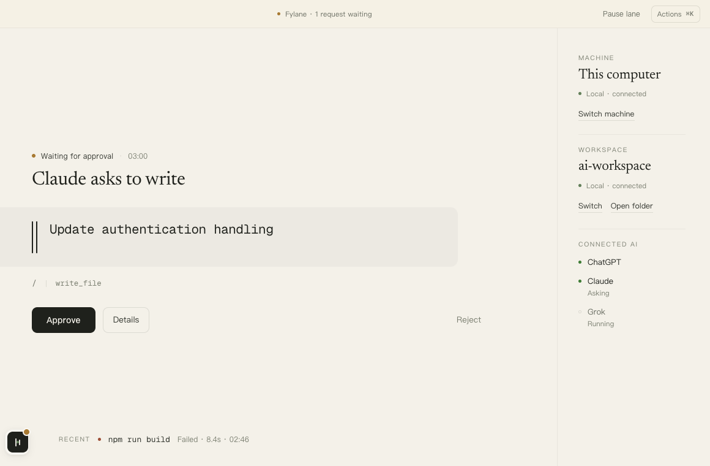
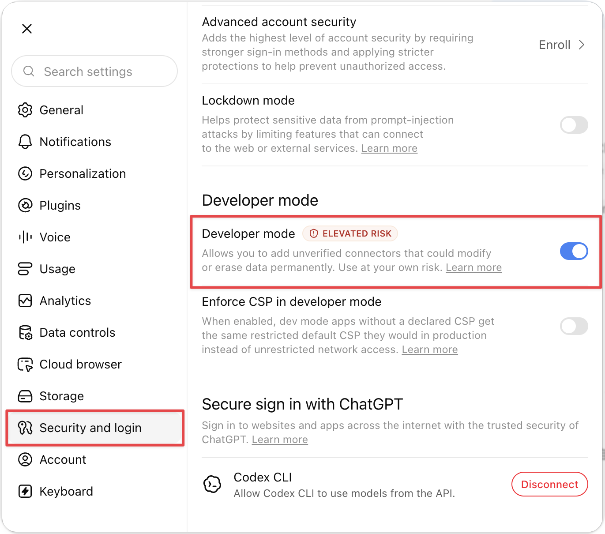
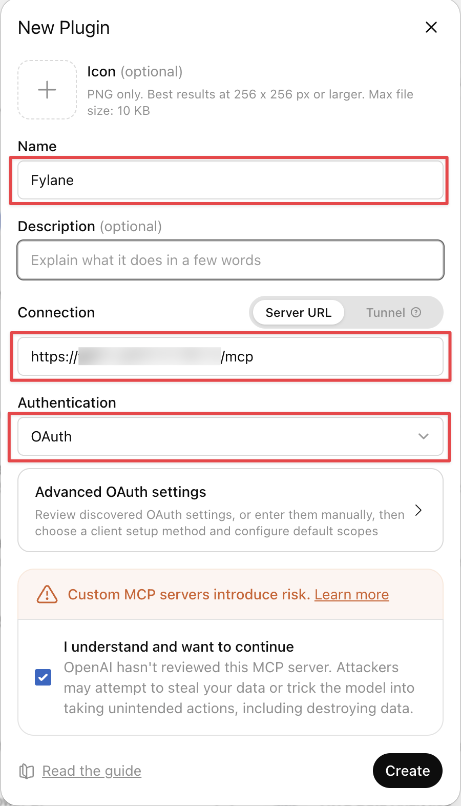
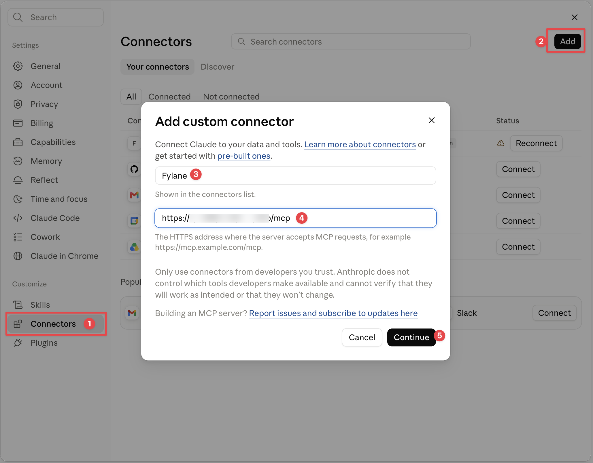
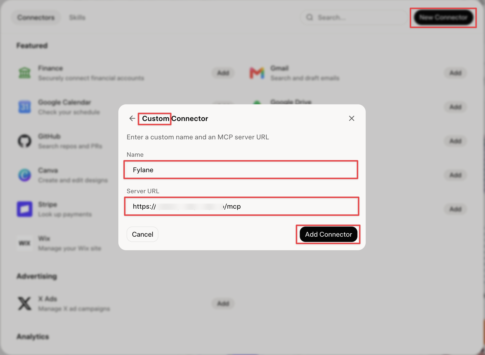

<div align="center">


# Fylane

**让网页版 ChatGPT、Claude、Grok 直接读写你电脑或 VPS 上的项目。改文件、跑命令前,都要你先点头。**

[English](README.md) | 简体中文

[](LICENSE)
[](go.mod)
[](https://modelcontextprotocol.io)

</div>

<br>

## 这是什么

网页版的 AI 看不到你电脑上的项目。想让它改个文件,只能把代码贴过去,再把结果贴回来。

Fylane 装在你电脑上。你选一个目录,网页版的 AI 就能连上来:读文件、改代码、跑测试。

AI 只能发请求。真正改文件、跑命令的是你电脑上的 Fylane,而且每次都先在窗口里给你看,你点批准才会执行。



能用来做什么:

- 让 ChatGPT 直接读项目,回答「这个报错是哪儿抛的」,不用贴代码。
- 让 Claude 改三个文件,你在 Fylane 里看完改动再批准。
- 让 Grok 跑 `npm test`,读回结果接着分析。
- 项目在 VPS 上也行,批准还是在你这台电脑上点。见[远程机器](#远程机器)。
- 明天开新对话,AI 能接着上次做。见[记忆](#记忆)。
- 合上电脑,AI 就连不上了。

## 它是怎么工作的

```
浏览器里的 AI  ──►  公网地址(隧道或中继)  ──►  你电脑上的 Fylane  ──►  你指定的目录
                                                       │
                                                  审批在这里发生
```

只有你电脑上的 Fylane 会碰你的文件。中间的公网地址只负责转发,什么都不存。

项目在 VPS 上时,多一段 ssh:

```
浏览器里的 AI  ──►  公网地址  ──►  你电脑上的 Fylane  ──ssh──►  VPS 上的 Fylane  ──►  服务器上的目录
                                        │
                                   审批还是在这里
```

VPS 上的 Fylane 不对外开放,只有你这台电脑能通过 ssh 连到它。AI 平台那边不用改,还是连同一个地址。

## 安装

从 [Releases](https://github.com/leazoot/fylane/releases/latest) 下载:

| 系统 | 下载 |
| --- | --- |
| macOS | `fylane-desktop-macos.dmg`,拖进「应用程序」 |
| Windows | `fylane-desktop-windows-amd64.zip`,解压后运行 `Fylane.exe` |
| Linux / 服务器 | 目前只有命令行版,见[命令行](#命令行) |

安装包暂时没有签名。macOS 第一次打开会提示「无法验证开发者」,去「系统设置 → 隐私与安全性」点「仍要打开」。Windows 弹出 SmartScreen 时点「更多信息 → 仍要运行」。想先核对文件,Release 页有 `SHA256SUMS`。

## 第一次打开

Fylane 会带你走四步,都在窗口里完成,不用开终端。


1. **选一个目录。** AI 只能看到这个目录,看不到它上面的任何东西。以后随时可以换或收回。
2. **试一次写入。** Fylane 往目录里写一个示例文件,让你看看批准是什么样。
3. **决定哪些要问你。** 默认每个目录只在第一次跑命令时问,之后普通命令直接跑;写文件和有风险的命令照样要问。以后可以在设置里改。
4. **接入一个 AI。** 在 AI 平台那边完成,见下一节。

完成后进入主界面。左边是通道,等你批准的请求出现在这里;右边是当前目录和已连接的 AI。


## 把 Fylane 接到 AI 平台

每个平台都是三步:在 Fylane 里复制地址,填到平台的连接器设置里,回 Fylane 批准连接。

### 第一步:在 Fylane 里拿到地址

打开「设置 → 接入方式」。


第一次用,选「Cloudflare 快速隧道」,点「设置」。不用注册,也不用域名,几秒后会出现一个 `https://xxx.trycloudflare.com/mcp` 的地址,点「复制」。

这个地址每次重启 Fylane 都会变,需要重新填到平台里。想要固定地址,见[固定地址](#固定地址)。

### 第二步:填到平台里

<details open>
<summary><b>ChatGPT</b></summary>

需要付费套餐(Plus / Pro / Team)。

1. 头像 → **设置 → 安全与登录** → 打开 **开发者模式**。旧版界面在「应用与连接器 → 高级」里。

   

2. 进 **插件**(旧版叫「应用与连接器」),点 **创建**,这样填:
   - Name:随便填,比如 `Fylane`
   - Connection:保持 **Server URL**,粘贴地址
   - Authentication:选 **OAuth**。选「无身份验证」会报 `Error creating connector`。
   - 勾上「I understand and want to continue」。

   

3. 点 Create,浏览器会打开一个页面,见第三步。
4. 在对话里点输入框旁边的 **+** → **更多**,勾上 `Fylane`。

</details>

<details>
<summary><b>Claude</b></summary>

1. 左下角头像 → **设置 → 连接器** → **添加自定义连接器**。
2. 名称填 `Fylane`,URL 粘贴地址。**高级设置里的 Client ID 和 Client Secret 留空**,填了会报错。
3. 点 **Continue**,再点列表里 Fylane 旁边的 **连接**,浏览器会打开授权页,见第三步。
4. 在对话里点输入框的 **工具** 按钮,确认 Fylane 已打开。



Claude 里每个工具可以设成「每次询问」或「总是允许」。这只是 Claude 那边的设置,Fylane 这边该问的照样会问。

</details>

<details>
<summary><b>Grok</b></summary>

1. grok.com → **设置 → 连接器** → **New Connector** → **Custom Connector**。
2. Name 填 `Fylane`,Server URL 粘贴地址,点 **Add Connector**。
3. 点连接,浏览器打开授权页,见第三步。



Grok 有几点不一样:

- **Grok 自己不会弹写入确认。** 用 Grok 时,Fylane 的写入确认最好保持开着。
- Grok 自带云端沙箱,你说「跑一下测试」,它可能在自己那边跑。要说清楚:「用 Fylane 的 run_command 跑测试」。
- Grok 一次调用只等 60 秒。60 秒内没批准,它会收到「等待批准」,批准后让它再试一次。

</details>

### 第三步:在 Fylane 里批准这次连接

平台会打开一个授权页,上面有一个短码。Fylane 窗口会同时弹出同样的码,核对一致后点「批准连接」。


如果你在另一台电脑的浏览器里操作,授权页会让你输配对码。在 Fylane「设置 → 接入方式」点「显示配对码」,填进去就行。配对码 10 分钟内有效,只能用一次。

### 试一下

回到对话,输入:

> 列一下这个项目根目录有哪些文件。

AI 会把目录列出来。读文件不需要批准。再试:

> 在项目里新建一个 hello.txt,内容写 hello。

Fylane 窗口会亮起来,显示 AI 要写的内容。点批准,文件才会出现;点拒绝,AI 会收到拒绝的消息。

## 审批和安全边界

**写文件要你批准。** AI 要新建、修改、删除、移动文件时,Fylane 会先给你看改了什么,你批准后才写入。

**写错了能撤销。** 批准过的写入 7 天内可以在「任务」页撤销。如果文件之后又被改过,撤销会停下,不会覆盖新内容。

**有些命令一律拒绝。** AI 只能跑单个程序,不能拼一整段 shell。用 `sudo` 提权、删除目录以外的文件、改动 `.git`、直接写磁盘,不管怎么设置都会被拒绝。

**有风险的命令会先问你。** 比如 `rm -r` 删目录、`git push`、丢掉未提交的改动、改文件权限、全局安装软件、查看进程列表。命令设成「工作区内允许」时,这些也不再问。

**用到目录以外会单独问。** 读环境变量、钥匙串,或者用到目录以外的路径,每次都会问你,哪一档都一样。

**敏感文件默认藏起来。** `.env`、`*.pem`、`id_rsa`、`credentials*` 这类文件不会出现在列表和搜索里。AI 点名要读时,会单独问你。

**跑的程序出不了这个目录。** 在 macOS 和 Linux 上,Fylane 替 AI 跑的程序(比如 `npm test`)只能读这个目录和开发工具需要的缓存。Windows 暂时没有这一层。

**AI 不知道目录在哪。** 它只看得到目录里面的路径。

**问不问可以自己调。** 命令有三档:「每次询问」「每个工作区首次询问」「工作区内允许」。写文件有三档:「每次写入都询问」「新建文件直接写入」「写入不再询问」,删除和敏感文件在哪一档都会问。不管怎么选,上面的检查一直都在。

所有记录都在本机,「任务」页能看到每条请求是谁发的、结果如何。


## 记忆

换个对话,也能接着上次继续。

Fylane 为每个目录记住两类内容:

- **当前状态**:做到哪了、接下来做什么、定了什么、还有哪些问题。
- **工作记录**:做过的事和重要决定。

开新对话不用重新解释背景,直接说「接着上次做」就行。

- 没接上,就说「先看看这个目录的记忆」。
- 做完一段工作,或者刚定了重要的事,说一句「记一下」。

记忆不会一直膨胀。当前状态会持续更新,旧记录可以整理成摘要,需要时原文仍然找得到。

在「记忆」页可以查看、修改、删除、导出或清空这些内容。所有记忆都存在 Fylane 里,不会写进你的项目文件。

## 远程机器

项目在 VPS 上,你在 Mac 前面,想让 AI 直接在 VPS 上改代码、跑测试。把那台机器接进来就行,AI 平台那边不用改。

**开始前**:在这台电脑的终端里,`ssh 用户@主机` 已经能免密登录。Fylane 用的就是系统自带的 ssh,你的密钥和 `~/.ssh/config` 照常生效,它不会问密码。

1. 在通道页右栏「机器」下,点「切换机器 → 添加远程机器…」,填你平时写在 `ssh` 后面的内容,比如别名或 `user@host`。
2. 如果那台机器上还没有 Fylane,点右栏的「安装 Fylane」,会自动装上和本机一样的版本。
3. 显示「已连接」后,在「工作区」下点「选择目录」,从那台机器上选一个目录,或者直接输入路径,比如 `~/project`。

之后用法和本机一样。AI 的读写和命令在 VPS 上执行,批准还是在你的 Mac 上点。「任务」页里,来自远程机器的记录会带上机器名。

几件事要知道:

- **VPS 上的 Fylane 不对外开放。** AI 要通过你这台电脑才能用到它,所以电脑关机时,那台 VPS 也用不了。
- **批准只在你这台电脑上。** 远程机器上的命令默认每次都问。
- **切换机器只改变通道页显示哪台机器。** 「任务」页照样显示所有机器,待批准的请求也不会被藏起来。
- 远程机器的数据在那台机器的 `~/.fylane/` 里。「移除」只是让这台电脑忘掉它,不会删那边的东西。
- 暂时不能在窗口里改远程机器的设置。Windows 桌面端需要系统自带的 OpenSSH 客户端。

## 固定地址

Cloudflare 快速隧道每次重启都换地址。想要不变的地址,在「设置 → 接入方式」里换一种:

| 方式 | 需要什么 | 地址 |
| --- | --- | --- |
| Cloudflare 快速隧道 | 什么都不需要 | 每次重启变 |
| Tailscale Funnel | 装 Tailscale,登录一次(免费) | 固定,`xxx.ts.net` |
| Cloudflare 命名隧道 | 一个托管在 Cloudflare 的域名 | 固定,你自己的域名 |
| ngrok | ngrok 账号 | 免费版每次变,付费版固定 |
| 自建中继 | 一台有公网域名的服务器 | 固定,你自己的域名 |

前四种 Fylane 会帮你启动和管理,在窗口里点「设置」就行。

自建中继适合团队,或多台电脑共用一个地址。它跑在你自己的服务器上,不存任何文件内容。部署方法见 [`deploy/`](deploy/):

```bash
FYLANE_RELAY_HOST=relay.example.com docker compose -f deploy/docker-compose.yml up -d
```

## 命令行

Linux 服务器这类没有桌面端的机器,可以用命令行版 `fylane-companion`。功能一样,只是在终端里批准:按 `y` 批准,按其他键拒绝。删除整个目录要输入 `yes`。

安装(macOS 和 Linux):

```bash
curl -fsSL https://raw.githubusercontent.com/leazoot/fylane/main/scripts/install.sh | sh
```

然后进到项目目录:

```bash
cd ~/projects/my-app
fylane-companion share
```

它会打印地址和配对码:

```
sharing my-app — starting a tunnel, this takes a few seconds

  Connector URL   https://swift-lane-9f2c.trycloudflare.com/mcp
  Pairing code    7K4M-2QB9   (valid for 10m0s)
```

接下来和桌面端一样:把地址填到平台,在授权页输入配对码。按 Ctrl-C 退出。在服务器上用 ssh 跑时,放进 `tmux` 或 `screen`,断开连接也不会停。

接自建中继:

```bash
fylane-companion pair -relay wss://relay.example.com/tunnel -register
fylane-companion serve -workspace ~/projects/my-app
```

从源码构建需要 Go 1.25:

```bash
git clone https://github.com/leazoot/fylane
cd fylane
go build -o bin/fylane-companion ./companion/cmd/companion
```

## AI 拿到的工具

| | 工具 |
| --- | --- |
| 读 | `list_directory` `read_file` `read_files` `search_files` `stat_path` `git_query` |
| 写 | `write_file` `edit_file` `apply_patch` `change_manage` |
| 跑 | `run_command` `task_status` `code_task` |
| 记 | `memory_recall` `memory_note` `memory_search` `memory_read` `memory_compact` |
| 导航 | `code_navigate`,查定义和引用 |
| 扩展 | `mcp_gateway`,转发到你电脑上的其他 MCP 服务 |

需要批准的写入和命令会先返回 `pending_approval`,等你在 Fylane 里决定。`change_manage` 负责移动、删除和撤销。

## 常见问题

| | |
| --- | --- |
| 我的代码会传到服务器上吗? | AI 读到的内容会发给 AI 平台,和你手动贴过去一样。除此之外不会发到别处,中间的转发也不存任何东西。 |
| AI 会不会把我的项目删了? | 删除的文件先进本机回收区。目录本身和 `.git` 删不掉。删一个有文件的目录要确认两次。 |
| 我不在电脑旁边怎么办? | 请求会在窗口里等着,你不点就什么都不会发生。嫌麻烦可以在设置里少问一些。 |
| 它什么命令都能跑吗? | 不能。只能跑单个程序。`sudo`、删目录以外的文件这类一律拒绝,`rm -r`、`git push` 这类默认会先问你。 |
| AI 换个对话还记得这个项目吗? | 记得,见[记忆](#记忆)。 |
| 项目在 VPS 上能用吗? | 能。用你现有的 ssh 连过去,批准还是在这台电脑上点。 |
| 支持哪些 AI? | ChatGPT、Claude、Grok 按上面三步就能接上。其他支持远程 MCP 的客户端也能用同样的方式连。 |

## 开发

```bash
go test ./...

cd desktop/frontend
npm install
npm test          # vitest
npm run harness   # 用示例数据预览每个界面,在 :5199
```

桌面端需要 [Wails v2](https://wails.io) 命令行和 Node 22+:

```bash
cd desktop
wails dev
```

## 安全

只有你在本机点的批准才算数,AI 平台上的确认只是提示。中继不保存文件内容、改动、目录列表或敏感文件名。

已知限制和漏洞报告方式见 [SECURITY.md](SECURITY.md)。

## 许可证

[Apache 2.0](LICENSE)
