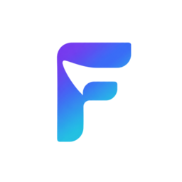
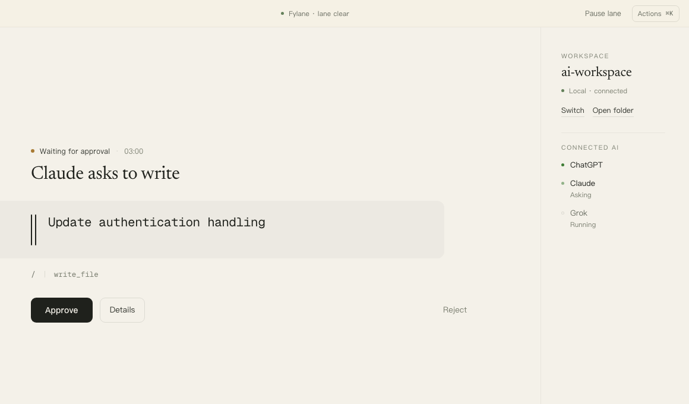
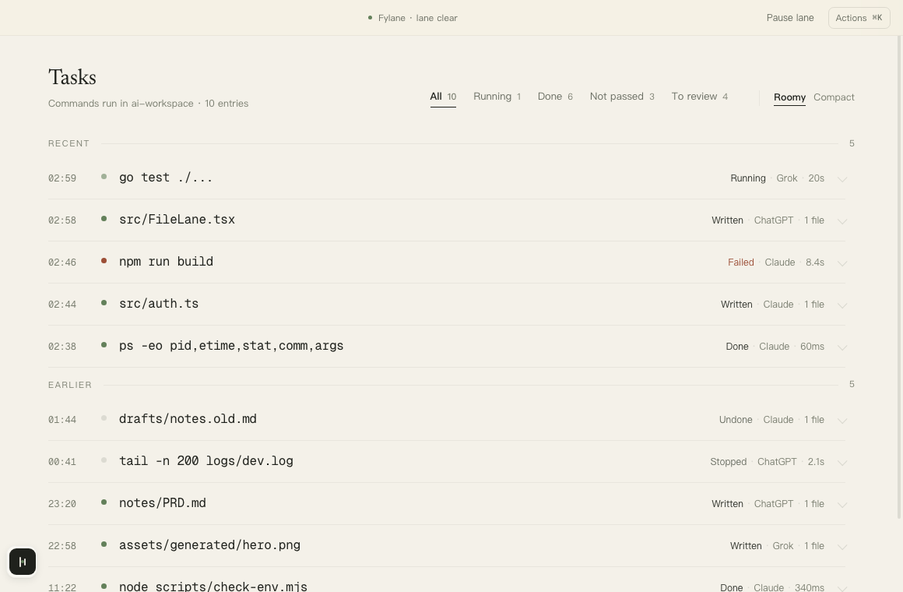
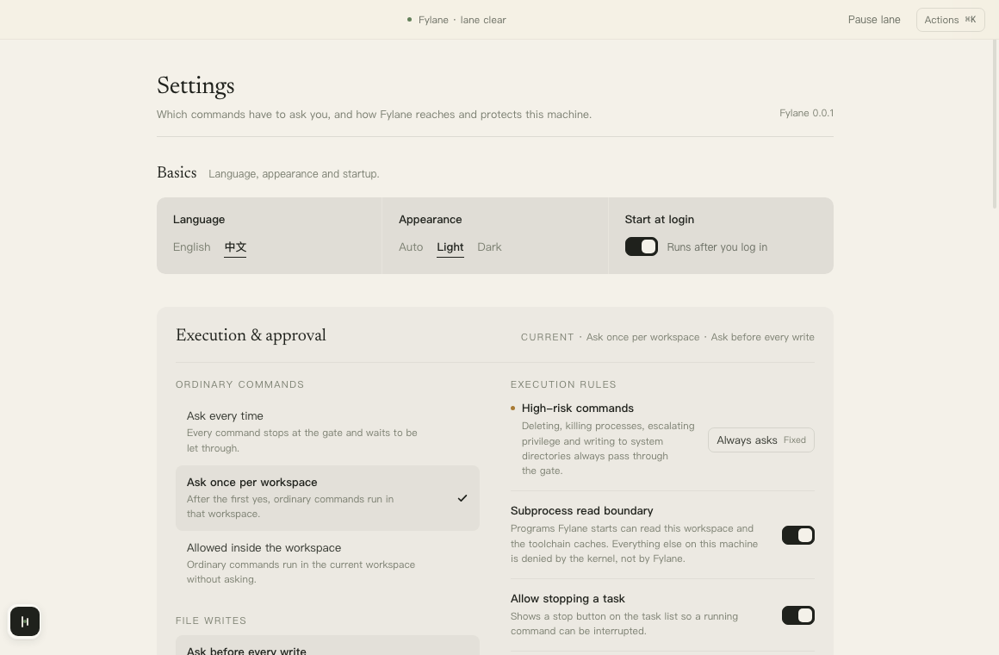

<div align="center">



# Fylane

**让 ChatGPT、Claude、Grok 在你电脑上的一个文件夹里干活。每一次写入都先停下来问你。**

[English](README.md) | 简体中文

[](LICENSE)
[](go.mod)
[](https://modelcontextprotocol.io)

</div>

<br>



Fylane 是一个跑在你自己电脑上的 MCP 服务。指定一个文件夹,接上任何支持 MCP
的对话,模型就能在里面读、改、跑命令——但每一步都要过一道你掌控的门。

什么都不上传。中转连接的 relay 只看到加密帧,不存文件、不存 diff、不存路径。
合上笔记本,AI 就再也够不到这台机器。

## 功能

- **每次写入都等你批准。** 落盘前先看到 diff,只有本地的一声「好」才能让它生效。
- **写入可以撤销,保留 7 天。** 每个变更集都留备份和回滚窗口;文件在此期间被
  改过,回滚会拒绝而不是覆盖。
- **AI 永远不知道东西在哪。** 工具只接受不透明的工作区 ID 和相对路径,绝对路
  径不出这台机器。
- **命令有边界,没有 shell。** 只有程序和参数——没有管道,没有 `sh -c`。破坏
  性命令在任何审批档位下都被规则表拒绝。
- **密钥够不着。** `.env`、`*.pem`、`id_rsa` 这一类在列表里隐藏、搜索时跳过,
  读取要单独再问一次。
- **内核级边界,不是口头承诺。** Fylane 启动的程序只能读工作区和工具链缓存,
  机器上其他一切由操作系统拒绝(macOS 用 `sandbox-exec`,Linux 用 Landlock)。
- **你决定被问的频率。** 每次都问、每个文件夹问一次、或者普通命令不问。
  无论选哪档,检查和审计日志都照常运行。

## 快速开始

需要 Go 1.25 或更新。

```bash
git clone https://github.com/leazoot/fylane
cd fylane
go build -o bin/fylane-companion ./companion/cmd/companion
```

指向一个文件夹。不用注册,不用配置文件。

```bash
cd ~/projects/my-app
fylane-companion share
```

它会打印一个公网地址和一个配对码:

```
sharing my-app — starting a tunnel, this takes a few seconds

  Connector URL   https://swift-lane-9f2c.trycloudflare.com/mcp
  Pairing code    7K4M-2QB9   (valid for 10m0s)
```

把这个 URL 作为 MCP 服务器加进 ChatGPT、Claude 或 Grok,第一次连接时按提示
输入配对码。让模型列一下目录,它就会把你的文件报回来。

按 Ctrl-C,隧道和配对码一起失效。

## AI 能做什么

| | 工具 |
| --- | --- |
| 读 | `list_directory` `read_file` `read_files` `search_files` `stat_path` |
| 写 | `write_file` `edit_file` `apply_patch` `change_manage` |
| 跑 | `run_command` `task_status` `code_task` |
| 导航 | `code_navigate` —— 由 language server 给出真实的定义与引用 |
| 扩展 | `mcp_gateway` —— 转发到你机器上的另一个 MCP 服务 |

写入和有后果的命令会返回 `pending_approval`,直到你做出决定。
`change_manage` 还负责移动、删除到回收区,以及回滚。

## 桌面端

Companion 本身可以无界面运行,但审批发生在桌面端:一条通道显示正在等你的事,
一份记录显示跑过什么,一页设置决定什么时候问你。

<table>
<tr>
<td width="50%"></td>
<td width="50%"></td>
</tr>
</table>

提供 macOS 和 Windows 桌面包;Companion 与 relay 另有 Linux 版本,Linux 桌面包暂未提供。

## 自建 relay

`share` 用的是一次性隧道。想要固定地址,就在自己的服务器上跑 relay——它处理
OAuth、在内存里转发帧,是唯一暴露在公网上的部件。

```bash
FYLANE_RELAY_HOST=relay.example.com docker compose -f deploy/docker-compose.yml up -d
```

同一份 compose 里的 Caddy 负责申请证书。relay 自己从不终结 TLS。

然后把 Companion 配对一次:

```bash
fylane-companion pair -relay wss://relay.example.com/tunnel -register
fylane-companion serve -workspace ~/projects/my-app
```

## 开发

```bash
go test ./...

cd desktop/frontend
npm install
npm test          # vitest
npm run harness   # 用固定数据渲染每个界面,在 :5199
```

桌面端需要 [Wails v2](https://wails.io) 命令行和 Node 22+:

```bash
cd desktop
wails dev
```

## 安全

本地审批是唯一的权威。平台侧的确认只是提示,从来不是安全层。relay 被视为
不可信的内容中转,从不持久化文件内容、diff、目录列表或敏感文件名。

报告漏洞请看 [SECURITY.md](SECURITY.md)。

## 许可证

[Apache 2.0](LICENSE)
